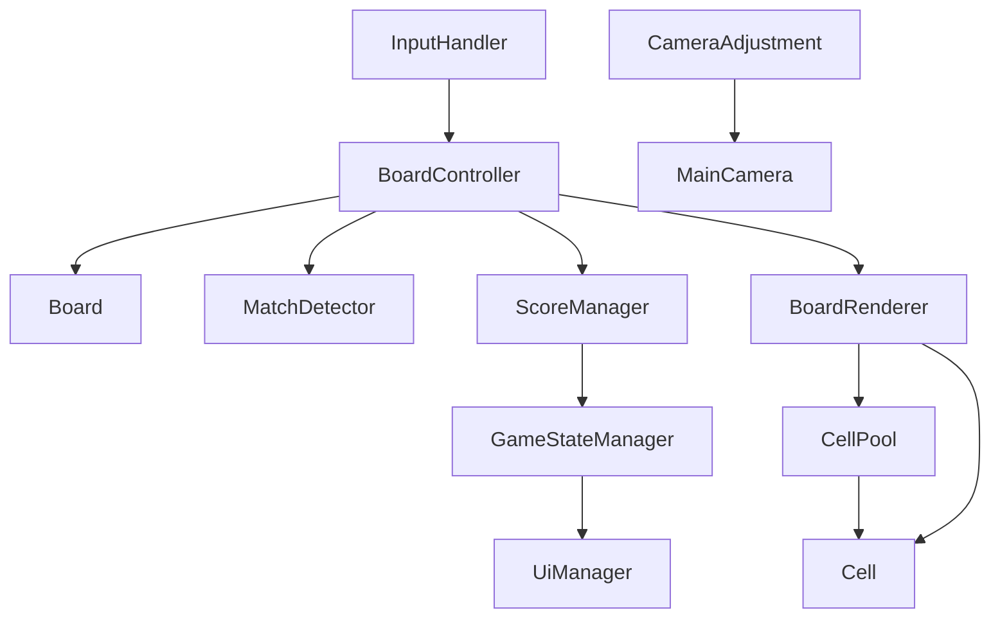
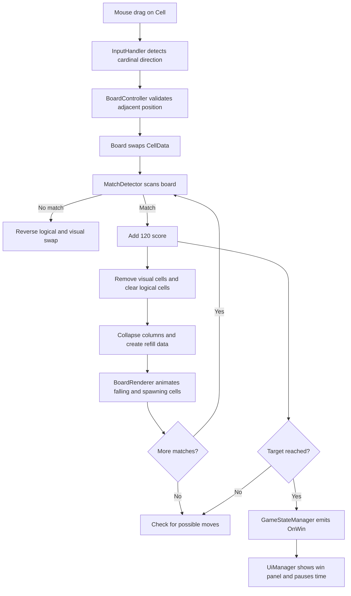

# Grid Puzzle Challenge

## Overview

Grid Puzzle Challenge is a Unity 2D match-3 puzzle game. The player selects a candy on the grid and drags the mouse horizontally or vertically to swap it with an adjacent candy. A swap is accepted only when it creates a horizontal or vertical group of at least three matching candies. Matches are removed, candies fall into the empty spaces, and new candies spawn from above. The objective is to reach the score target shown in the current level.

## Features

- Grid-based logical board with configurable width and height
- Four candy types: Orange, Green, Yellow, and Blue
- Mouse drag/swipe input over a candy
- Cardinal-direction detection with a minimum swipe distance
- Adjacent tile swapping with animated presentation
- Match detection for horizontal and vertical groups of three or more
- Rejection and animated rollback of swaps that create no match
- Match removal, gravity/collapse, and refill from above
- Cascading match resolution until the board is stable
- Score display and configurable target score
- Win state and win panel when the target score is reached
- Possible-move scan after match resolution
- Orthographic camera adjustment for the configured board dimensions
- Scene-based level transition and restart buttons
- Cell object pooling for the four candy prefab types

## Architecture

The project separates the logical board state from its visual representation.

### Logical Board State

`Board` owns a `CellData[,]` array. It initializes the grid, validates coordinates, swaps `CellData` entries, clears matches by assigning `CellType.Empty`, and calculates gravity/refill results. `CellData` is a lightweight value type containing a `CellType` enum value.

`BoardController` coordinates gameplay. It creates the `MatchDetector`, initializes the logical board and renderer, consumes input, validates the target position, performs logical swaps, and runs match resolution coroutines.

### Visual Rendering

`BoardRenderer` owns a separate `Cell[,]` visual-reference array. It obtains `Cell` instances from `CellPool`, maps them to logical positions, updates references after swaps, releases matched visuals, and animates swaps, falling cells, and newly spawned cells. `Cell` stores its visual grid position and type and moves its `GameObject` to the corresponding world coordinate.

This means the game can test and update the logical grid independently from the animated `GameObject` instances shown on screen.

## Gameplay Flow

```text
Mouse press on a Cell
        |
        v
InputHandler records world position
        |
Mouse release -> cardinal swipe direction
        |
        v
BoardController validates adjacent target
        |
        v
Board.TrySwap updates CellData
        |
        v
MatchDetector.FindMatches()
        |
   Match found?
     /     \
   No       Yes
   |         |
Swap back   Animate swap and update visual references
             |
             v
        Add 120 score
             |
             v
        Remove matches
             |
             v
        Clear logical cells
             |
             v
        Collapse columns and refill
             |
             v
        Animate result
             |
             v
        Repeat until no matches remain
             |
             v
        Scan for a possible move
```

## Core Systems

### Board and BoardController

`Board` is the source of truth for the grid. `BoardController` coordinates input, board mutations, matching, scoring, and the coroutine-based move sequence. It also blocks new input while a move or resolution is in progress.

### Input

`InputHandler` enables a serialized `InputAction` bound to the mouse left button. It raycasts from the mouse position into the 2D scene, requires the hit object to contain a `Cell`, and converts the drag into one of four cardinal directions. The configured minimum swipe distance is `0.25` world units in the gameplay scenes.

### Match Detection

`MatchDetector` scans every non-empty board position. It checks three consecutive cells horizontally and vertically, adding all positions in matching runs to a `HashSet` so overlapping matches are resolved together.

### Rendering and Animation

`BoardRenderer` maintains the visual grid and uses coroutines for smooth swaps and collapse/refill animations. Logical moves are calculated by `Board`; the renderer receives the resulting `CellMove` and `CellSpawn` data and applies the corresponding visual motion.

### Scoring and Game State

`ScoreManager` displays the score and target score through TextMesh Pro. Each successful player swap adds a fixed `120` points, regardless of the number of matched cells or cascades. Reaching the serialized target invokes `GameStateManager` with `GameStates.OnWin`.

`GameStateManager` is a static event-based state broadcaster with `OnGame` and `OnWin` states. `UiManager` subscribes to it, toggles the game and win panels, pauses time on win, restarts the active scene, and loads the next build scene.

### Camera

`CameraAdjustment` centers the orthographic camera on the configured board and calculates a camera size from board width, height, cell size, aspect ratio, and padding.

## Game Rules

- The player presses on a candy and drags at least `0.25` world units.
- The drag is reduced to the dominant horizontal or vertical direction.
- Only an in-bounds adjacent cell can be selected as the swap target.
- A swap is valid only if the resulting board contains at least one horizontal or vertical match of three or more equal candy types.
- An invalid swap is animated and then reversed in both the logical and visual grids.
- A valid swap adds `120` points once, then removes all currently detected matches.
- Removed cells become empty, remaining cells fall downward per column, and new random candies fill the top positions.
- Cascades are checked and resolved until no matches remain.
- The player wins when the score reaches or exceeds the level target.
- There is no implemented move counter or loss state.
- The game scans for possible swaps after resolution. If none exist, it logs `No possible moves!`; the planned shuffle is not implemented, so the board is not automatically repaired.

## Level System

Levels are separate Unity scenes in `Assets/Scenes/` and are loaded through Build Settings. The enabled build order is:

1. `GameScene.unity`: 4x4 board, target score `1000`.
2. `GameScene 2.unity`: 8x8 board, target score `2250`.

When the win panel's next-level action calls `UiManager.LoadNextLevel()`, the next build index is loaded, wrapping back to the first build scene after the last. `GameScene 1.unity` exists in the project but is disabled in Build Settings, so it is not part of the normal build sequence.

## Object Pooling

`CellPool` pre-instantiates a queue of cells for each of the four `CellType` values. `BoardController` requests `board.Width * board.Height` instances per type during startup. `BoardRenderer` obtains cells with `CellPool.Get`, parents active cells to the board renderer, and returns matched cells with `CellPool.Release`, which disables them and queues them for reuse. This avoids repeatedly instantiating and destroying candy `GameObject` instances during match resolution and refill.

## Technical Decisions

- **Data and presentation separation:** `Board` uses a `CellData[,]` grid while `BoardRenderer` uses a separate `Cell[,]` visual map, allowing logical swaps and animations to be coordinated explicitly.
- **Coroutine-driven resolution:** `BoardController` sequences swap, rollback, removal, collapse, refill, and animation without accepting another move while `isBusy` is true.
- **Deterministic swap validation:** a tentative logical swap is tested with `MatchDetector`; a no-match result is reversed.
- **Column-based collapse:** `Board.CollapseAndFill` compacts each column toward `y = 0`, returns existing-cell moves and top-entry spawn data, and lets `BoardRenderer` animate both sets.
- **Initial board generation:** `Board` avoids creating an immediate horizontal or vertical run of three while filling the starting grid. Refill cells use a random type from the four available types.
- **Pooling:** `CellPool` reuses the four candy prefab types to reduce runtime allocation during repeated clears and refills.
- **Input implementation:** runtime gameplay uses a serialized mouse-left-button `InputAction` and 2D point-overlap detection. The project also contains a generated `InputSystem_Actions.inputactions` asset with template actions, but `BoardController` does not consume its `Move` action.

## Project Structure

```text
Assets/
├── _Script/
│   ├── Board/
│   │   ├── Board.cs
│   │   ├── BoardController.cs
│   │   ├── BoardRender.cs
│   │   └── CameraAdjustment.cs
│   ├── Cell/
│   │   ├── Cell.cs
│   │   └── CellData.cs
│   ├── GameManager/
│   │   ├── GameStateManager.cs
│   │   └── MatchDetector.cs
│   ├── InputSystem/
│   │   └── InputHandler.cs
│   ├── Object Pool/
│   │   └── CellPool.cs
│   ├── ScoreManager/
│   │   └── ScoreManager.cs
│   └── UiManager/
│       └── UiManager.cs
├── Prefans/
│   ├── Blue.prefab
│   ├── Green.prefab
│   ├── Orange.prefab
│   └── Yellow.prefab
├── Scenes/
│   ├── GameScene.unity
│   ├── GameScene 1.unity
│   ├── GameScene 2.unity
│   └── SampleScene.unity
├── Graphic/
├── Settings/
├── TextMesh Pro/
└── InputSystem_Actions.inputactions
Packages/
ProjectSettings/
```

The folder names above match the repository, including the existing `Prefans` and singular `_Script` names.

## How to Run

1. Clone the repository.
2. Open the project with Unity `6000.3.9f1`.
3. Open `Assets/Scenes/GameScene.unity`, which is the first enabled build scene.
4. Press Play.
5. Click and drag from a candy in a horizontal or vertical direction. Use the win panel's restart or next-level buttons when available.

The enabled build scenes are also listed in `ProjectSettings/EditorBuildSettings.asset`. The project uses the Universal Render Pipeline 2D setup and the Input System package.

## Controls

```text
Left mouse press on a candy + drag up    -> Try an upward swap
Left mouse press on a candy + drag down  -> Try a downward swap
Left mouse press on a candy + drag left  -> Try a left swap
Left mouse press on a candy + drag right -> Try a right swap
```

A short click below the minimum swipe distance is ignored. Keyboard, gamepad, and touch controls are not implemented by `InputHandler`.

## Architecture Diagram



## Functional Flow Diagram



## Known Limitations

- The no-valid-move check only logs a message. The comment in `BoardController` identifies shuffle as future work, and no shuffle implementation exists.
- There is no move counter, move limit, timer, or explicit game-over state.
- Score is fixed at `120` per successful swap rather than being calculated from match size or cascade depth.
- The runtime input handler supports mouse drag gestures only. The generated Input System action asset contains additional template actions that are not wired into gameplay.
- `CellPool.Get` logs an error when a per-type pool is exhausted rather than expanding the pool.
- `SampleScene.unity` is a template-style scene without the puzzle gameplay setup. `GameScene 1.unity` is disabled in Build Settings.

## Assignment Requirements

| Requirement | Status | Implementation |
|---|---|---|
| Grid-based match-3 board | Implemented | `Board` stores a configurable grid; gameplay scenes configure 4x4 and 8x8 boards. |
| Player-controlled adjacent swaps | Implemented | `InputHandler` and `BoardController` support cardinal mouse drags. |
| Match detection and removal | Implemented | `MatchDetector`, `Board.ClearMatches`, and `BoardRenderer.RemoveMatches`. |
| Gravity and refill | Implemented | `Board.CollapseAndFill` returns movement/spawn data for `BoardRenderer`. |
| Score target and win condition | Implemented | `ScoreManager` emits `OnWin` when the target is reached. |
| Multi-level progression | Implemented | `UiManager` loads the next enabled build scene and wraps at the end. |
| No-valid-move handling | Partially implemented | Possible moves are detected, but shuffle/recovery is not implemented. |

## Author

Punit Sehrawat
